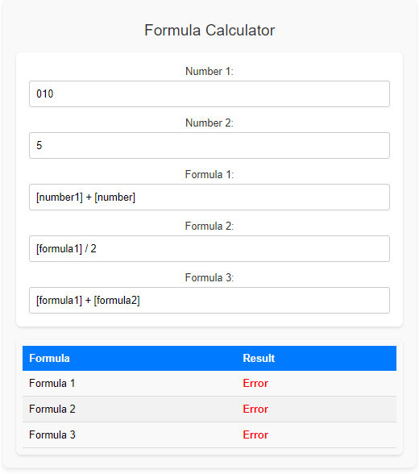

# React Formula Calculator

A dynamic formula calculator built with React that allows users to input numbers and mathematical formulas. The app evaluates these formulas dynamically and displays the results.

## Features

- Input fields for two numbers.
- Input fields for three formulas.
- Dynamic evaluation of formulas.
- Safe evaluation using `mathjs` to avoid security risks.

## Demo



## Getting Started

Follow these instructions to get a copy of the project up and running on your local machine.

### Prerequisites

- Node.js (https://nodejs.org/)
- npm (https://www.npmjs.com/)

### Installation

1. Clone the repository:

   ```sh
   git clone https://github.com/sandesh682/formulaCalculator.git
   ```

2. Install required dependencies

   ```sh
   npm install
   ```

3. Run application

   ```sh
   npm start
   ```
